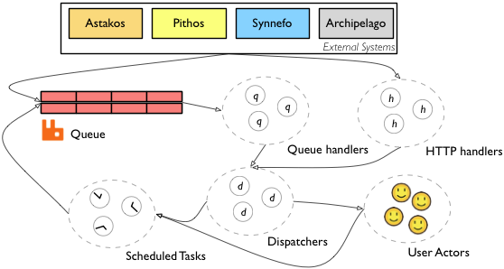

Aquarium Development Guide
==========================

The development guide includes descriptions of the APIs and extention points
offered by Aquarium. It also includes design and development setup information.

Overall architecture
--------------------

Aquarium's architectural design is mainly driven by two requirements: scaling
and fault tolerance. Aquarium's functionality is based on event sourcing.
`Event sourcing <http://en.wikipedia.org/wiki/Domain-driven_design>`_ 
assumes that all changes to application state are stored as a
sequence of events, in an immutable log. With such a log at hand, a system can
rebuild the current application state by replaying the events in order. The event
sourcing design pattern has some very interesting properties, which made it
particularity suitable for basing Aquarium on it:

- Multiple models can be used in order to process the events, concurrently. This means that Aquarium can provide a limited data view to its REST API and a more detailed one to a helpdesk frontend.

- It is possible to perform queries on past system states by stopping the event replay at a certain point of interest. This would prove very possible for a future debugging interface.

- In a carefully implemented event sourcing system, application crashes are not destructive, as long as event replay is fast enough and no state is inserted to the application without being recorded to the event log first.

- After event log replay, new events only cause updates in the system’s in-memory state, which can be done very fast.

Components
^^^^^^^^^^

An overview of the Aquarium architecture is presented in the figure above.  The
system is modeled as a collection of logically and functionally isolated
components, which communicate by message passing. Withing each component, a
number of actors take care of concurrently processing incoming messages through
a load balancer component which is the gateway to requests targeted to the
component. Each component is also monitored by its own supervisor; should an
actor fail, the supervisor will automatically restart it. The architecture
allows certain application paths to fail individually while the system is still
responsive, while also enabling future distribution of multiple components on
clusters of machines.

The system receives input mainly from two sources: a queue for resource and
user events and a REST API for credits and resource state queries. The queue
component reads messages from a configurable number of queues and persists them
in the application’s immutable log store. Both input components then forward
incoming messages to a network of dispatcher handlers which do not do any
processing by themselves, but know where the user actors lay. Actual processing
of billing events is done within the user actors. Finally, a separate network
of actors take care of scheduling periodic tasks, such as refiling of user
credits; it does so by issuing events to the appropriate queue.

The accounting system
----------------------

The accounting subsystem deals with charging users for services used and 
providing them with credits in order to be able to use the provided services.
As with the rest of the Aquarium, the architecture is open-ended: the accounting
system does not know in advance which services it supports or what resources
are being offered. The configuration of the accounting system is done
using a Domain Specific Language (DSL) described below. 

Data exchange with external systems is done through events, which are
persisted to an *immutable log*.

The accounting system is a generic event-processing engine that is configured by a
DSL. The DSL is mostly based on the
`YAML <http://en.wikipedia.org/wiki/Yaml>`_ 
format. The DSL supports limited algorithm definitions through integration of the Javascript language as defined below.

Glossary of Entities
^^^^^^^^^^^^^^^^^^^^

- *Credit*: A credit is the unit of currency used in Aquarium. It may or may not 
  correspond to real money.
- *Resource*: A resource represents an entity that can be charged for its usage. The 
  currently charged resources are: Time of VM usage, bytes uploaded and downloaded and bytes used for storage
- *Resource Event*: A resource event is generated from an external source and are permanently appended in an immutable event log. A raw event carries information about changes in an external system that could affect the status of a user's wallet (See more about `Resource Events`_).
- *AccountingEntry*: An accounting entry is the result of processing a resource event and is what gets stored to the user's wallet.
- *Price List*: A price list contains information of the cost of a resource. 
  A pricelist is only applied within a specified time frame.
- *Algorithm*: An algorithm specifies the way the charging calculation is done. It can be vary  depending on resource usage, time of raw event or other information.
- *Credit Plan*: Defines a periodic operation of refiling a user's wallet with a
  configurable amount of credits.
- *Agreement*: An agreement associates pricelists with algorithms and credit
  plans. An agreement is assigned to one or more users/credit holders.
- *Billing Period*: A billing period defines a recurring timeslot at the end
  of which the accumulated resource usage is accounted for and reset.

Overall Schema
^^^^^^^^^^^^^^

The Aquarium policy DSL allows the hierarchical definition of agreements, by
means of compositing ingredients and specifying validity periods for individual
components or for the policies themselves. The DSL also allows overriding
between items of the same class (i.e. an algorithm definition can override
certain fields of another algorithm definition, while both definitions can 
be referenced individually). 

The top-level schema for the DSL is as follows.

.. code-block:: yaml

  aquariumpolicy:
    resources:
      - resource:
        ... [see Resources]

    algorithms:
      - algorithm:
        ... [see Algorithms]

    pricelists:
      - pricelist:
        ... [see Pricelists]

    creditplans:
      - creditplan:
        ... [see Creditplans]

    agreements:
      - agreement:
        ... [see Agreements]

Time frames
^^^^^^^^^^^

Time frames allow the specification of applicability periods for algorithms,
pricelists and agreements. A timeframe is by default continuous and has a
starting point; if there is no ending point, the timeframe is considered open
and its ending point is the time at the time of evaluation. 

A time frame definition can contain repeating time ranges that dissect it and
consequently constrain the applicability of the time frame to the defined
ranges only. A range always has a start and end point. A range is repeated
within a timeframe, until the timeframe end point is reached. In case a
repeating range ends later than the containing timeframe, the ending time is
adjusted to match that of the timeframe.

The definition of the starting and ending point of a time range is done in a 
syntax reminisent of the `cron <http://en.wikipedia.org/wiki/Cron>`_ format. 

.. code-block:: yaml

  effective:
    from: %d                         # Milliseconds since the epoch
    to:  %d                          # [opt] Milliseconds since the epoch
    repeat:                          # [opt] Defines a repetion list
      - every:                       # [opt] A repetion entry 
        start: "min hr dom moy dow"  # 5-elem cron string
        end:   "min hr dom moy dow"  # 5-elem cron string 

The following declaration defines a timeframe starting at the designated
timestamp and ending at the time of evaluation.

.. code-block:: yaml

  effective:
    from: 1293703200  #(30/12/2010 10:00)

The following declaration defines a timeframe of one year, within which the
applicability of the specified policy, agreement or pricelist is constrained to
time ranges from 12:00 Mon to 14:00 Fri  (first ``every`` definition)
and 15:00 Sat to 15:00 Sun.

.. code-block:: yaml

  effective:
    from: 1293703200  #(30/12/2010 10:00)
    to:   1325239200  #(30/12/2011 10:00)
    repeat:
      - every:
        start: "00 12 * * Mon"
        end:   "00 14 * * Fri"
      - every:
        start: "00 15 * * Sat"
        end:   "00 15 * * Sun"

Resources
^^^^^^^^^

A resource represents an entity that can be charged for. Aquarium does not
assume a fixed set of resource types and is extensible to any number of
resources. A resource has a ``name`` and a ``unit``; both are free form
strings. The resource name is used to uniquely identify the resource both inside
Aquarium and among external systems.

A resource definition also has a two fields that define how a resource is
charged and whether a user can be assigned more instances of a resource.
Specifically, the ``costpolicy`` field can have the following values:

- `continuous:` For ``continuous`` resources, the charging algorithm calculates the
  total amount of resource usage over time, per billing period. Each new
  resource event modifies the resource usage counter and forces Aquarium
  to calculate a new cost for the previous amount of resource usage. A typical
  example  of a continuous resource is disk space.
- `onoff:` ``onoff`` resources are a category of continuous resources where the
  resource can only be in two states, on or off. In such cases, maintaining a usage
  counter is not necessary; the charging algorithm uses time as the unit of
  calculation. Virtual machine time is a typical example.
- `discrete:` ``discrete`` resources are charged for instantly for the
  reported resource value. Examples are bandwidth and every resource whose usage
  is not a function of time (books, hits to an API etc). 

Regarding resource complexity, a resource can either be labeled complex 
or not. In the former case, a resource can have more than one instances per
user, and resource usage is tracked individually per instance. The 
``instance-id`` field in the resource event message (See `Resource Events`_) 
helps Aquarium separate resource instances at charge time. 

The following resource definition defines the `bandwidthup` 
resource. 

.. code-block:: yaml

  resource:
    name: bandwidthup
    unit: MB/hr
    complex: false
    costpolicy: discrete

Algorithms
^^^^^^^^^^

An algorithm specifies the algorithm used to perform the cost calculation, by
combining the reported resource usage with the applicable pricelist. As opposed
to price lists, algorithms define behaviours, which have certain
validity periods. 

.. code-block:: yaml

  algorithm:
    name: default
    bandwidthup:   {price} times {volume} 
    bandwidthdown: {price} times {volume}
    vmtime: {price} times {volume}
    diskspace: {price} times {volume}
    effective: 
      [see Time frames]

Price lists
^^^^^^^^^^^

A price list defines the prices applicable for a resource within a validity
period. Prices are attached to resource types and denote the policies that
should be deducted from an entity's wallet in response to the entity's resource
usage within a given charging period (currently, a month). The format is the
following:

.. code-block:: yaml

  pricelist:                  # Pricelist structure definition  
    name: apricelist          # Name for the price list, no spaces, must be unique
    [extends: anotherpl]      # [Optional] Inheritance operation: all optional fields  
                              # are inherited from the named pricelist
    bandwidthup:              # Price for used upstream bandwidth per MB 
    bandwidthdown:            # Price for used downstream bandwidth per MB
    vmtime:                   # Price for time 
    diskspace:                # Price for used diskspace, per MB
    effective:
      [see Timeframe format]

Credit Plans
^^^^^^^^^^^^

Credit plans define how user accounts are refilled with credits. A credit plan
has 

.. code-block:: yaml

  creditplan:
    name: default
    credits: 100
    at: "00 00 1 * *"
    effective:
      from: 0

Agreements
^^^^^^^^^^

An agreement is the result of combining an with algorithm with a pricelist
and a creditplan. As the
accounting DSL's main purpose is to facilitate the construction of agreements
(which are then associated to users), the agreement is the centerpiece of
the language. An agreement is defined in full using the following template:

.. code-block:: yaml

  agreement:
    name: someuniqname        # Unique name for 
    extends: other            # [opt] name of inhereted agreement 
    pricelist: plname         # Name of declared pricelist
      resourse: value         # [opt] Overiding of price for resource
    algorithm: polname           # Name of declared policy
      resourse: value         # [opt] Overiding of algorithm for resourse

An agreement definition can either reuse the pricelists, algorithms and creditplans 
defined above (referenced by name) or define the effective algorithm or pricelist
in place.
If a ``pricelist`` or ``algorithm`` name has not been defined explicitely (and
therefore referenced by name), all prices or algorithms for the declared
resources must be defined in either the  ``agreement`` or one of its parents.

As with all DSL resources, agreements can be overriden by other agreements.

Examples
^^^^^^^^^
.. toctree::

  unicase 

Events
------

Aquarium communicates with external systems through events published on an `AMQP <http://en.wikipedia.org/wiki/AMQP>`_ queue. Aquarium only understands events in the
`JSON <http://www.json.org/>`_ format.

Aquarium events share a common base format consisting of the following fields:

.. code-block:: javascript

  {
    id: "SHA-1",
    occurredMillis: 12345,
    receivedMillis: 12346 
  }

- *id:* [``string``] A per message unique string. Should be able to identify messages of the same type uniquely across Aquarium clients. Preferably a SHA-1.
-  *occurredMillis:* [``long``] The timestamp at the event creation time. In milliseconds since the epoch.
- *receivedMillis:* [``long``] For Aquarium internal use. Clients should not set a value. If a value is set, it will be overwritten upon receipt.

In the following sections, we describe the exact format of each one of the concrete messages that Aquarium can process.

Resource Events
^^^^^^^^^^^^^^^

A resource event is sent by Aquarium clients to signify a change in a resource's
state. This change is processed by Aquarium's accounting system according to 
the provisions of the configured policy in order to create entries to the user's
wallet.

.. code-block:: javascript

  {
    id: "<SHA-1>",
    occurredMillis: 1321020852,
    receivedMillis: 1321020852,
    clientID: "platform-wide-unique-ID",
    userID: "administrator@admin.grnet.gr",
    resource: "vmtime",
    instanceId: "vmtime-01.02.123X.Z",
    eventVersion: "1.0", 
    value: 0.3,
    details: {
      keyA: "value1",
      keyB: "value2",
    }
  }

The meaning of the fields is as follows:

- *id:* As above.
-  *occurredMillis:* As above.
- *receivedMillis:* As above. 
- *clientID:* ``string`` A unique name for each message producer.
- *userID:* ``string`` The ID of the user that will be charged for the resource usage details reported in the resource event. 
- *resource* ``string`` The name of the resource as declared in the Aquarium DSL. See `Resources`_ for more. 
- *instanceId* ``string`` If the resource is complex, then this field is set to a unique identifier for the specific instance of the resource. In case of a non-complex resource, Aquarium does not examine this value.
- *eventVersion* ``string`` The event version. Currently fixed to "1". 
- *value*: ``double`` The value of resource usage. Depends on the cost policy defined for the resource as follows:
   + For ``continuous`` resources, the value indicates the amount of resource usage since the last resource event for the specific resource.
   + For ``onoff`` resources, it is set to 1 when the resource is actively used and to 0 when the resource usage has stopped.
   + For ``discrete`` resources, the field indicates the amount of resource usage at the time of the event.
- *details*: ``map[string, string]`` A map/dictionary indicating extra metadata for this resource event. Aquarium does not process this metadata. The field must always be present, even if it is empty.

User Events
^^^^^^^^^^^

The charging algorithm
----------------------

The 

The Aquarium REST API
---------------------

The Aquarium REST API is used to query a 

As Aquarium is a backend system, clients are trusted and therefore no
authentication is required for accessing Aquarium's API.

Get User Balance
^^^^^^^^^^^^^^^^

**GET** /user/*id*/balance

**Normal Response Code**: 200

**Error Response Codes**: itemNotFound (404), timeout (500) 

The operation returns the current balance for a user. 

**Example get balance response**

.. code-block:: javascript

  {
    userId: "1234"
    balance: "321,32"
  }

Document Revisions
------------------

==================    ================================
Revision              Description
==================    ================================
0.1 (Nov 2, 2011)     Initial release. Credit and debit policy descriptions 
0.2 (Feb 23, 2012)    Update definitions, remove company use case
0.3 (Feb 28, 2012)    Event and resource descriptions
==================    ================================

